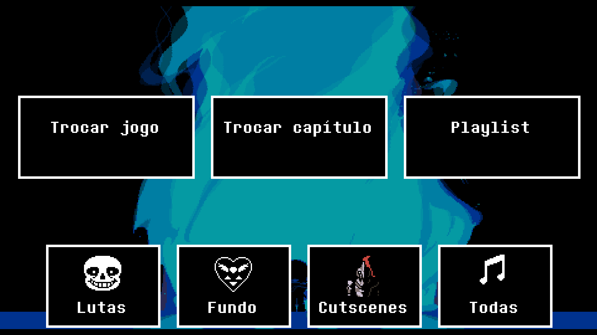

# ❤️ SoulTune

**SoulTune** é um aplicativo desenvolvido em **GameMaker** para que todos possam apreciar as incríveis trilhas sonoras de **Undertale** e **Deltarune**, compostas pelo lendário **Robert F. "Toby" Fox** – um verdadeiro gênio musical.

> **Aviso:** Este aplicativo é um projeto de fã, sem fins lucrativos, criado apenas para fins de apreciação musical. Todos os direitos sobre as músicas pertencem a Toby Fox. Se gostar das trilhas, apoie o criador comprando as versões oficiais no [Bandcamp](https://tobyfox.bandcamp.com/).

---

## ✨ Funcionalidades
- Interface simples e intuitiva para selecionar e ouvir as músicas.
- Catálogo completo das faixas de *Undertale* e *Deltarune* (capítulos lançados).
- Reprodução contínua e sem interrupções.
- Informações sobre cada faixa: nome, álbum e duração.
- Sistema de playlists para criar sua própria ordem de reprodução.

---

## 📸 Capturas de Tela

---

## 💻 Tecnologias Utilizadas
- [GameMaker](https://gamemaker.io/) — Engine principal do aplicativo.
- Manipulação de áudio com funções nativas da engine.
- Sistema de carregamento dinâmico de faixas.

---

## 📥 Como Usar
1. Baixe a versão mais recente do aplicativo (link na seção de releases).
2. Abra o executável `SoulTune.exe` ou instale o aplicativo `SoulTune.apk`.
3. Escolha sua música favorita e aperte **Play**!

---

## 📜 Créditos
- **Músicas**:  
  - Toby Fox – *Undertale* & *Deltarune*  
  - Lena Raine – Contribuições musicais em *Deltarune*  
  - Marcy Nabors – Assistência musical em *Deltarune*  

- **Vozes**:  
  - Laura Shigihara – Vocal em "Don't Forget" (*Deltarune* Capítulo 1, OST 39)  
  - Itoki Hana – Vocal em "Sanctuary" (*Deltarune* Capítulo 2)  

- **Arte e Animação**:  
  - Temmie Chang – Arte e animações originais de *Undertale* & *Deltarune*  

- **Memes de Asgore**:  
  - Gif: @Triki_Tr0y (Twitter)  
  - Música: @KennyTheLyr1c1st, @zebuez (YouTube)  
  - Música (versão alternativa): @MythicApex, @Bub8les, @RagamuffinWLYR (YouTube)  

- **Desenvolvimento**:  
  - Luca Cunha (Frisk)  

- **Programas usados**:  
  - GameMaker Studio 2 – YoYo Games  
  - Visual Studio Code – Microsoft  
  - Visual Studio 2022 – Microsoft  
  - Git & GitHub – Microsoft  
  - Undertale Mod Tool – MattyIce  
  - YT-DLP – yt-dlp  

- **Fontes**:  
  - 8bitoperator – Fonte usada no aplicativo  

- **Efeitos Sonoros**:  
  - Extraídos de *Undertale* & *Deltarune* – Toby Fox  

- **Agradecimentos Especiais**:  
  - @leticiasilva667
  - @nowachaox
  - @vallemm_01
  - @.karshinov.
  - @huds_chaox
  - @yaazurem
  - @luca_house
  - @zaki_zeon
  - @laerinfx
  - @tomveronezzi

---

## ⚠️ Aviso Legal
Este projeto é **não oficial** e **não afiliado** ao Toby Fox.  
Todos os direitos autorais das músicas, imagens e vozes pertencem aos seus respectivos detentores.  
Se você gosta do trabalho de Toby Fox, apoie-o adquirindo as trilhas e os jogos originais.

## 🎵 Nomes envolvidos nas músicas
- **Toby Fox** – Compositor de todas as músicas de *Undertale* e da maioria em *Deltarune*.  
- **Lena Raine** – Compositora convidada em *Deltarune*.  
- **Marcy Nabors** – Assistência musical em *Deltarune*.  
- **Laura Shigihara** – Cantora do OST 39 do capítulo 1 de *Deltarune*: "Don't Forget".  
- **Itoki Hana** – Cantora de "Sanctuary" no capítulo 2 de *Deltarune*.  